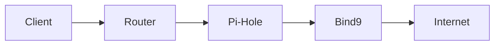
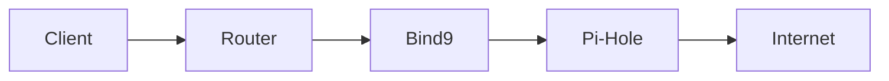

# PiHole, DNS and nice URLs with Traefik

## Background

I have been wanting to setup a Pi-Hole on my HomeLab for a while now and I finally got around to doing it.

<!-- end-excerpt -->

I had a few considerations that I needed to account for:

1. I already use a DNS server locally (Bind9) that I use to enable access to services through nice URLs (using `*.home.stalhem.se` for my internal stuff), and I want these to keep working
2. I wanted the Pi-Hole to block ads and tracking on all devices without having to set that up on each device individually
3. I wanted to run the Pi-Hole on my Mac Mini-server since it has better performance than the Raspberry Pi 5
4. I use Tailscale on my own devices in order to access my Home Lab from anywhere without exposing anything through my router

## DNS Service order

Initially I set up this flow:

However, this caused issues since I am running Traefik on my Raspberry Pi. Traefik uses Cloudflare and Let's Encrypt to issue certificates and therefore allow HTTPS-traffic to the services it has configured. Routing requests via the Pi-Hole changed the DNS-lookup chain, which made the certificates invalid. I therefore had to switch the order around to this:

Bind9 is configured to use the Pi-Hole as the only upstream DNS, so any requests that are not to local services are forwarded there.

The Pi-Hole in turn uses Cloudflare DNS (1.1.1.1 and 1.0.0.1) as upstream DNS, so any requests that are not blocked by the Pi-Hole are sent there for resolving.

## Router Setup

I've also configured the Router to use the IP of the Raspberry Pi as the primary DNS server for the internal network. This ensures that any client that is issued an IP by the router, also initially talks to the Bind9 server as the primary DNS.

## Tailscale

Along the way, I also remembered (and forgot a few times) that, since I am using Tailscale, I need to modify that configuration in order to allow clients that are actively connected to the Tailscale network to also use Bind9 as the primary DNS server.

This was possible to set up using what Tailscale calls "Split DNS". Essentially, this forces any queries to a specific URL to use a different IP as the DNS server rather than the normal one.

## Additional considerations

This setup works fine for the most part. I have one issue I would like to resolve and a few other thoughts.

At the moment, the logs in Pi-Hole shows that all requests are coming from `home.stalhem.se`. This is because all requests are routed from the Bind9 server. I would like to forward all the client information so that it is possible to see which client on the network is actually sending what traffic.

I am also considering moving the Bind9 server over to the Mac Mini. This might allow me to use the Docker container name as the upstream DNS server for Bind9, and should possibly speed up request time between the containers (not that it is particularly slow at the moment). This might be problematic though since that would mean that if the Mac Mini fails for some reason, the entire DNS-chain breaks. It can be fixed easily by removing the settings on the Router though, so it's probably not much of a problem.
